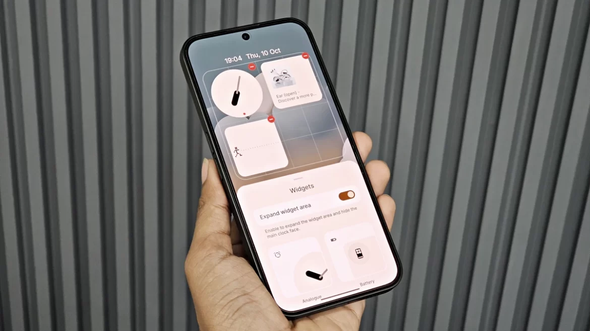

# Jane Doe

## Senior Software Architect

[jane.doe@email.com](mailto:jane.doe@email.com) |
[github.com/janedoe](https://github.com/janedoe) |
[linkedin.com/in/janedoe](https://linkedin.com/in/janedoe) |
San Francisco, CA |
(555) 123-4567

### Summary

Innovative Software Architect with 12+ years of experience designing and implementing scalable, distributed systems. Expert in cloud architecture, microservices, and enterprise application integration. Strong background in leading technical teams and driving architectural decisions aligned with business objectives.

### Skills

System Architecture

&#9733;
&#9733;
&#9733;
&#9733;
&#9733;

Cloud Services (AWS/Azure)

&#9733;
&#9733;
&#9733;
&#9733;
&#9733;

Microservices

&#9733;
&#9733;
&#9733;
&#9733;
&#9733;

DevOps/CI/CD

&#9733;
&#9733;
&#9733;
&#9733;
&#9734;

Java/Spring

&#9733;
&#9733;
&#9733;
&#9733;
&#9733;

Node.js/TypeScript

&#9733;
&#9733;
&#9733;
&#9733;
&#9734;

SQL/NoSQL Databases

&#9733;
&#9733;
&#9733;
&#9733;
&#9734;

Docker/Kubernetes

&#9733;
&#9733;
&#9733;
&#9733;
&#9734;

API Design/REST/GraphQL

&#9733;
&#9733;
&#9733;
&#9733;
&#9733;

### Languages

English
Native

Spanish
Fluent

German
Intermediate

### Certifications

<strong>AWS Certified Solutions Architect</strong> - Professional (2023)

<strong>Microsoft Azure Solutions Architect</strong> - Expert (2022)

<strong>Certified Kubernetes Administrator (CKA)</strong> (2021)

### Professional Experience

<h4>Lead Software Architect <em>TechNova Inc., San Francisco, CA | 2020-Present</em></h4>
<ul>
<li>Lead architecture design for a cloud-native financial services platform serving 2M+ customers</li>
<li>Designed and implemented microservices architecture that reduced system latency by 40% and improved scalability</li>
<li>Developed architectural roadmap and migration strategy from monolith to microservices</li>
<li>Established technical governance processes and architectural guidelines for development teams</li>
<li>Mentored 15+ engineers in architectural design patterns and best practices</li>
</ul>

<h4>Senior Solutions Architect <em>Global Systems Technology, Seattle, WA | 2017-2020</em></h4>
<ul>
<li>Designed distributed systems architecture for e-commerce platform handling 100K+ transactions daily</li>
<li>Implemented event-driven architecture that improved system throughput by 60%</li>
<li>Led architecture assessment and modernization initiatives for 5 major product lines</li>
<li>Established CI/CD pipelines reducing deployment time from days to hours</li>
<li>Created reference architecture documentation used company-wide</li>
</ul>

<h4>Software Architect <em>InnovateTech Solutions, Boston, MA | 2014-2017</em></h4>
<ul>
<li>Designed scalable backend systems for healthcare data processing platform</li>
<li>Led migration from on-premises infrastructure to AWS, reducing operational costs by 35%</li>
<li>Implemented API gateway pattern for service integration, improving system modularity</li>
<li>Developed architectural standards for RESTful API design and implementation</li>
<li>Conducted technical due diligence for 3 acquisition targets</li>
</ul>

<h4>Senior Software Engineer <em>Digital Dynamics, San Jose, CA | 2011-2014</em></h4>
<ul>
<li>Developed core components of distributed data processing application</li>
<li>Designed and implemented performance monitoring system reducing issue resolution time by 50%</li>
<li>Led team of 6 engineers for backend development projects</li>
<li>Contributed to architectural decisions for system scaling and reliability improvements</li>
</ul>

### Notable Projects

<h4>Enterprise Integration Platform <em>TechNova Inc. | 2021-2022</em></h4>
<ul>
<li>Designed API-led connectivity architecture enabling seamless system integration</li>
<li>Implemented event-driven messaging system using Kafka for real-time data processing</li>
<li>Developed reference implementations and documentation for integration patterns</li>
<li>Reduced integration development time by 60% through standardized connectors</li>
</ul>

<h4>Cloud Migration Framework <em>Global Systems Technology | 2018-2019</em></h4>
<ul>
<li>Architected multi-phase cloud migration strategy for legacy applications</li>
<li>Developed containerization approach for 200+ microservices</li>
<li>Designed infrastructure-as-code templates for automated environment provisioning</li>
<li>Created disaster recovery architecture with 99.99% uptime SLA</li>
</ul>

### Education

<h4>Master of Science in Computer Science <em>Stanford University | 2011</em></h4>
Specialization in Distributed Systems

<h4>Bachelor of Science in Computer Engineering <em>University of California, Berkeley | 2009</em></h4>
Minor in Mathematics

